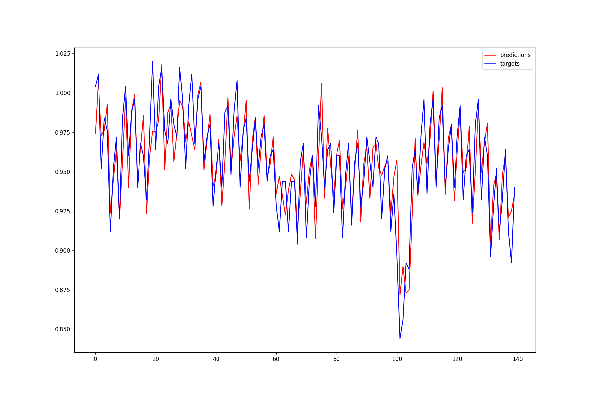

# `pplib` - The Point Process Library

This site contains the *scientific* and `code` documentation for [pplib](https://github.com/andreabonvini/pplib), a `python` library for *Point Process Analysis*.

The *scientific documentation* consists of a series of quick blog-posts explaining the theoretical details behind the algorithmic implementation.

The *code documentation* consists of a series of code snippets showing the usage of the library.

## Scientific Documentation

#### Background knowledge

- [Hazard Function in Survival Analysis](theory_docs/Hazard Function in Survival Analysis.html)
- [Inhomogenous Poisson Process in the Time Domain](theory_docs/Inhomogenous Poisson Process in the Time Domain.html)

#### Model the Inter-Event pdf through the Inverse Gaussian distribution.

- [Inverse Gaussian: How to model the inter-event probability density function and define the likelihood.](theory_docs/Inverse Gaussian - MLE for Point Process Analysis.html)
- [Inverse Gaussian: How to *derive* the *gradient* vector and *hessian* matrix for maximum likelihood estimation.](theory_docs/Inverse Gaussian - Gradient and Hessian - Derivation.html)
- [Inverse Gaussian: How to *compute* the *gradient* vector and *hessian* matrix for maximum likelihood estimation.](theory_docs/Inverse Gaussian - Gradient and Hessian - Computation.html)

## Code Documentation

#### Usage

```python
from pp import InterEventDistribution, PointProcessDataset
from pp import regr_likel
# Suppose we have a np.array inter_events containing inter-event times expressed in seconds.
# Build a dataset object with the specified AR order (p) and hasTheta0 option (if we want to account for the bias)
dataset = PointProcessDataset.load(
    inter_events_times=inter_events,
    p=9,
    hasTheta0=True
)
# We pass to regr_likel the dataset defined above and the distribution we want to fit 
pp_model = regr_likel(dataset, InterEventDistribution.INVERSE_GAUSSIAN)

# We build the same dataset without the hasTheta0 option just to test our model:
dataset = PointProcessDataset.load(
    inter_events_times=inter_events,
    p=9,
    hasTheta0=False
)
test_data = dataset.xn
targets = dataset.wn
predictions = [pp_model(sample).mu for sample in test_data]
# We can then plot our predictions against the actual targets...
```



#### `InterEventDistribution`

```python
class InterEventDistribution(Enum):
    INVERSE_GAUSSIAN = "Inverse Gaussian"
#TODO add more distributions...
```

#### `WeightsProducers`

In order to weight the samples of our dataset (e.g. giving more importance to more recent samples) we can supply `regr_likel`  with a third argument `weights_producer`.

```python
# regr_likel signature:
def regr_likel(
        dataset: PointProcessDataset,
        maximizer_distribution: InterEventDistribution,
        weights_producer: WeightsProducer = ExponentialWeightsProducer()
) -> PointProcessModel:
```

We have two types of `WeightsProducers`:

- `ConstantWeightsProducer`: weights the samples by the same amount (i.e. `1`)

- `ExponentialWeightsProducer`: weights the samples with a decreasing exponential function `w(t)=exp(-alpha*t)`

	where $t$ is the time distance from the most recent sample's target interval.

	```python
	class ExponentialWeightsProducer(WeightsProducer):
	    def __init__(self, alpha: float = 0.005):
	        """
	        Args:
	            alpha: Weighting time constant that governs the degree of influence
	                    of a previous observation on the local likelihood.
	        """
	        self.alpha = alpha
	
	    def __call__(self, target_intervals: np.ndarray) -> np.ndarray:
	        """
	            Args:
	                target_intervals:
	                    Target intervals vector (as stored in PointProcessDataset.wn)
	        """
	        self.target_intervals = target_intervals
	        return self._compute_weights()
	
	    def _compute_weights(self) -> np.ndarray:
	        target_times = np.cumsum(self.target_intervals) - self.target_intervals[0]
	        return np.exp(-self.alpha * target_times).reshape(-1, 1)[::-1]
	 
	```

```python
from pp import ExponentialWeightsProducer,ConstantWeightsProducer

wp = ExponentialWeightsProducer(alpha = 0.01) # or ConstantWeightsProducer()
pp_model = regr_likel(dataset, InterEventDistribution.INVERSE_GAUSSIAN, wp)
```

