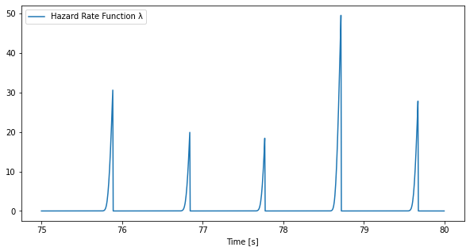

This site contains the *scientific* and `code ` documentation for [pointprocess](https://github.com/andreabonvini/pointprocess), a `Python` library for *Point Process Analysis*.


The *scientific documentation* consists of a series of quick blog-posts explaining the theoretical details behind the algorithmic implementation.

## Scientific Documentation

#### Background knowledge

- [Hazard Function in Survival Analysis](theory_docs/Hazard Function in Survival Analysis.html)
- [Inhomogenous Poisson Process in the Time Domain](theory_docs/Inhomogenous Poisson Process in the Time Domain.html)

#### Model the Inter-Event pdf through the Inverse Gaussian distribution.

- [Inverse Gaussian: How to model the inter-event probability density function and define the likelihood.](theory_docs/Inverse Gaussian - MLE for Point Process Analysis.html)
- [Inverse Gaussian: How to *derive* the *gradient* vector and *hessian* matrix for maximum likelihood estimation.](theory_docs/Inverse Gaussian - Gradient and Hessian - Derivation.html)
- [Inverse Gaussian: How to *compute* the *gradient* vector and *hessian* matrix for maximum likelihood estimation.](theory_docs/Inverse Gaussian - Gradient and Hessian - Computation.html)

## Quick Tour

#### `Usage`

Suppose we have a `np.ndarray` `events` which contains the time of a series of events.

```python
print(events)
array([ 657.938,  658.875,  659.758,  ..., 1311.391, 1312.336,
       1313.273])
```

We can visualize the inter-event intervals

```python
import numpy as np
import matplotlib.pyplot as plt
# Visualize the dataset
plt.figure(figsize=(6,3),dpi = 150)
plt.plot(np.diff(events),"b")
plt.xlabel("Sample")
plt.ylabel("Inter Event Time [s]")
```


By visual inspection, we can select a segment that looks approximately stationary, for example the heart beats with indices $75$ to $300$.

We can fit a known distribution (for this brief tutorial we we'll use the Inverse Gaussian distribution) by optimizing for the $\theta$ parameters (i.e. the AR coefficients for the estimate of the first moment of the IG distribution) and the scaling factor $k$ by means of the `regr_likel` function:

```python
from pp.model import PointProcessDataset,InterEventDistribution
from pp.regression import regr_likel
# Build a PointProcessDataset object
dataset = PointProcessDataset.load(events[75:300],p = 8) # p: AR order
# Train the model and retrieve the result
result = regr_likel(dataset,InterEventDistribution.INVERSE_GAUSSIAN,max_steps = 100)
```

The returned object in this case in a `InverseGaussianResult`:

```python
@dataclass
class InverseGaussianResult:
    """
        Args:
            theta: final AR parameters.
            k: final shape parameter (aka lambda).
            current_time: current evaluatipon time
            mu: final mu prediction for current_time.
            sigma: final sigma prediction for current_time.
            mean_interval: mean target interval, it is useful just 
            	to compute the spectral components.
            target: (Optional) expected mu prediction for current_time
    """

    theta: np.ndarray
    k: float
    current_time: float
    mu: float
    sigma: float
    mean_interval: float
    target: Optional[float] = None
```

So if we want compare our predictions for the first moment of the IG distribution with the target intervals we can proceed in the following way:

```python
original_mus = dataset.wn
predicted_mus = np.dot(dataset.xn,result.theta)
plt.figure(figsize=shape,dpi = 150)
plt.plot(original_mus,"r")
plt.plot(predicted_mus,"b")
plt.legend(["Target $\mu_s$","Predicted $\mu_s$"])
```


Once we have obtained the optimal parameters, we can compute a spectral analysis of the data:

```python
analysis = compute_psd(result.theta,result.mean_interval,result.k)
# Plot the total power associated with each frequency
plt.plot(analysis.frequencies,analysis.powers,"k--")
# Plot the power associated with each single pole
for component in analysis.comps:
    plt.plot(analysis.frequencies,np.real(component))
plt.xlabel("f[Hz]")
plt.ylabel("PSD[ms$^2$/Hz]")
```


```python
# We can aggregate complex conjugate by passing the argument aggregate=True
analysis = compute_psd(result.theta,result.mean_interval,result.k,aggregate=True)
# Plot the total power associated with each frequency
plt.plot(analysis.frequencies,analysis.powers,"k--")
# Plot the power associated with each single pole
for component in analysis.comps:
    plt.plot(analysis.frequencies,np.real(component))
plt.xlabel("f[Hz]")
plt.ylabel("PSD[ms$^2$/Hz]")
```


If we want real-time estimates of the $\theta$ and $k$ parameters we can optimise by shiftting a moving window of length `window_length` by a little time step `delta` using the `regr_likel_pipeline` function.

```python
# If we specify a csv_path as argument, the function will automatically create this .csv for us containing all the useful information.
# On the other hand if we don't supply the function with the csv_path, a list of InverseGaussianResult objects will be returned.
csv_path = "test.csv"
regr_likel_pipeline(
    events,
    ar_order=8,
    window_length = 60,
    delta=0.005,
    csv_path = csv_path
)
```

```
🧠🫀Processing🫀🧠: 100%|##########| 119067/119067 [01:22<00:00, 1451.33it/s]
Regression pipeline completed! 🎉🎉 csv file saved at: 'test.csv' 👌
```

We can then load the `csv` and assess goodness of fit by means of the `ks_distance` 

```python
import pandas as pd
df = pd.read_csv(csv_path)

delta = df["TIME_STEP"][1] - df["TIME_STEP"][0]
events = np.array(df["EVENT_HAPPENED"])
times = np.array(df["TIME_STEP"])
mus = np.array(df["MU"])
targets = np.array(df["TARGET"])
lambdas = np.array(df["LAMBDA"])

print(df.columns)
```

```
>>> Index(['TIME_STEP', 'MEAN_WN', 'K', 'MU', 'SIGMA', 'LAMBDA', 'EVENT_HAPPENED',
          'TARGET', 'THETA_0', 'THETA_1', 'THETA_2', 'THETA_3', 'THETA_4',
          'THETA_5', 'THETA_6', 'THETA_7', 'THETA_8', 'THETA_9'],
           dtype='object')
```

```python
from pp.plot import ppplot,lambda_plot
ppplot(times,mus,events,targets)
```


```python
taus = compute_taus(lambdas, events, delta)
KSdistance = ks_distance(taus,plot = True)
print(f"KSdistance: {KSdistance}")
```


```
>>> KSdistance: 0.050398
```

```python
lambda_plot(lambdas)
```


```python
lambda_plot(lambdas[3000:4000])
```



